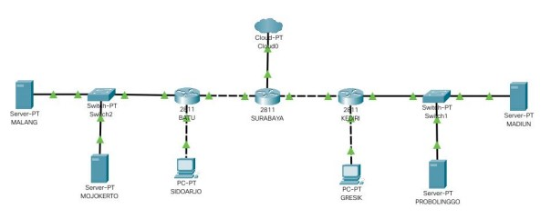
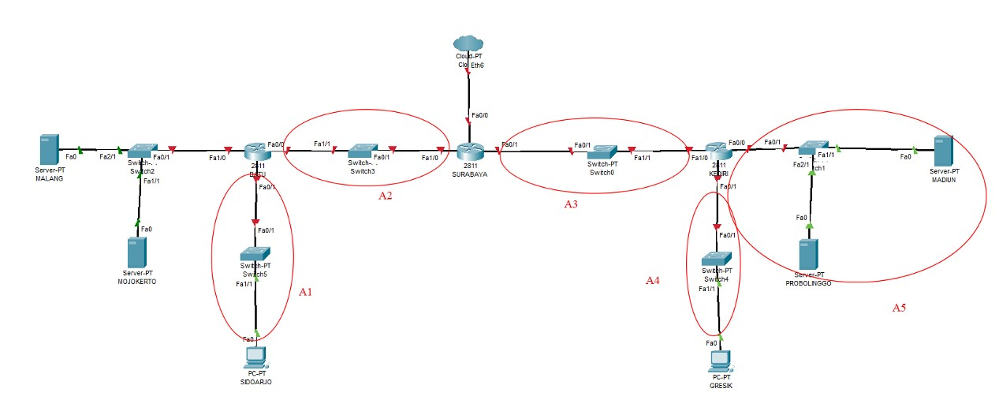
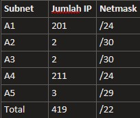
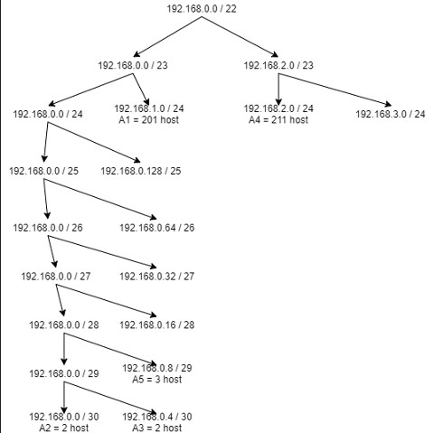
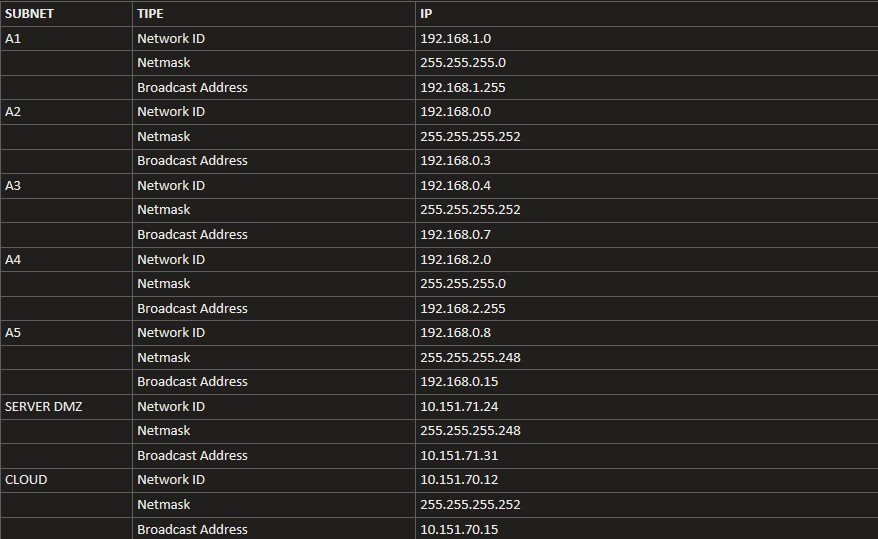
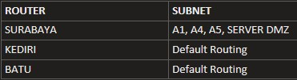

# Laporan Resmi Jarkom Modul 5

## Settingan UML

**(A)** Tugas pertama kalian yaitu membuat topologi jaringan sesuai dengan rancangan yang diberikan
Bibah seperti dibawah ini :



Keterangan : 
- SURABAYA diberikan IP TUNTAP
- MALANG merupakan DNS Server diberikan IP DMZ
- MOJOKERTO merupakan DHCP Server diberikan IP DMZ
- MADIUN dan PROBOLINGGO merupakan WEB Server
- Setiap Server diberikan memory sebesar 128M
- Client dan Router diberikan memori sebesar 96M
- Jumlah host pada subnet SIDOARJO 200 Host
- Jumlah host pada subnet GRESIK 210 Host

**(B)** karena kalian telah mempelajari Subnetting dan Routing, Bibah meminta kalian untuk membuat topologi tersebut menggunakan teknik CIDR atau VLSM. Setelah melakukan subnetting, **(C)** kalian juga diharuskan melakukan routing agar setiap perangkat pada jaringan tersebut dapat terhubung.

**(D)** Tugas berikutnya adalah memberikan ip pada subnet SIDOARJO dan GRESIK secara dinamis menggunakan bantuan DHCP SERVER (Selain subnet tersebut menggunakan ip static). Kemudian kalian mengingat bahwa kalian harus setting DHCP RELAY pada router yang menghubungkannya, seperti yang kalian telah pelajari di masa lalu.

### Jawab :
Pembagian Subnet :



Lakukan perhitungan IP yang dibutuhkan :



Dengan VLSM kita mendapat pohon seperti ini :



Maka didapat tabel pembagian IP :



Lalu lakukan pembuatan topologi dan pengisian subnet di masing-masing UML berdasarkan tabel.

Untuk routing yang harus dilakukan :



## Soal

### Soal 1
Agar topologi yang kalian buat dapat mengakses keluar, kalian diminta untuk mengkonfigurasi SURABAYA menggunakan iptables, namun Bibah tidak ingin kalian menggunakan
MASQUERADE.

#### Jawab

Kita bisa mengganti MASQUERADE dengan perintah SNAT dimana kita spesifikan ip yang ingin digunakan adalah IP dari eth0 SURABAYA.

```
iptables -t nat -A POSTROUTING -o eth0 -j SNAT --to-source 10.151.70.14
```

Keterangan :

- `-t nat` : Disini kita menggunakan tabel NAT karena kita ingin melakukan perubahan di alamat-alamat dari paket. 
- `-A POSTROUTING` : Lalu kita menggunakan chain POSTROUTING karena perubahan dilakukan setelah proses routing dilakukan. 
- `-o eth0` : Packet keluar melalui eth0 SURABAYA
- `-j SNAT` : Kita mengganti source dari packet
- `--to-source 10.151.70.14` : Parameter setelah SNAT dimana kita menspesifikan ip source ingin diganti dengan ip apa. Disini kita menggunakan IP eth0 dari SURABAYA

### Soal 2

Kalian diminta untuk mendrop semua akses SSH dari luar Topologi (UML) Kalian pada server yang memiliki ip DMZ (DHCP dan DNS SERVER) pada SURABAYA demi menjaga keamanan.


#### Jawab

Di SURABAYA, jalankan perintah di bawah ini:
```
iptables -N LOGGING
iptables -A FORWARD -d 10.151.71.24/29 -i eth0 -p tcp --dport 22 -j LOGGING
iptables -A LOGGING -j LOG --log-prefix "IPTables-Dropped: "
iptables -A LOGGING -j DROP
```

Keterangan (Dibahas hanya yang baris 2 karena baris lainnya akan dibahas di no 7) :
- `-A FORWARD` : UML bertindak sebagai forwarder, maka memakai chain FORWARD
- `-d 10.151.71.24/29` : Destinasi adalah subnet DMZ dimana terletak server-server
- `-i eth0` : Ingoing interface adalah eth0, karena yang di-drop adalah paket dari luar
- `-p tcp` : SSH memakai protokol TCP, maka di perintah kita spesifikan protokolnya adalah TCP
- `--dport 22` : SSH memakai port 22, maka setelah `-p` kita spesifikan port nya dengan parameter `--dport`
- `-j LOGGING` : jump ke target LOGGING, di mana di target LOGGING paket pada akhirnya di-drop

### Soal 3

Karena tim kalian maksimal terdiri dari 3 orang, Bibah meminta kalian untuk membatasi DHCP dan DNS server hanya boleh menerima maksimal 3 koneksi ICMP secara bersamaan yang berasal dari mana saja menggunakan iptables pada masing masing server, selebihnya akan di DROP.

#### Jawab

Di MALANG dan MOJOKERTO jalankan perintah :
```
iptables -N LOGGING
iptables -A INPUT -p icmp -m connlimit --connlimit-above 3 --connlimit-mask 0 -j LOGGING
iptables -A LOGGING -j LOG --log-prefix "IPTables-Dropped: "
iptables -A LOGGING -j DROP
```

Keterangan (Dibahas hanya yang baris 2 karena baris lainnya akan dibahas di no 7) :

- `-A INPUT` : Karena paket masuk ke UML maka menggunakan chain INPUT
- `-p icmp` : Menspesifikan protocol yang diguanakan adalah ICMP
- `-m connlimit` : Menggunakan rule limit connection
- `--connlimit-above 3` : Limit yang akan ditangkap paket adalah di atas 3
- `--connlimit-mask 0` : Menspesifikan bahwa maks hanya diperbolehkan 3 IP berbeda yang melakukan koneksi

### Soal 4

Kalian diminta untuk membatasi akses ke MALANG dimana akses dari subnet SIDOARJO hanya diperbolehkan pada pukul 07.00 - 17.00 pada hari Senin sampai Jumat. Selain itu paket akan di REJECT.

#### Jawab

Kita jalankan perintah berikut di MALANG

```
iptables -A INPUT -s 192.168.1.0/24 -m time --timestart 07:00 --timestop  17:00 --weekdays Mon,Tue,Wed,Thu,Fri -j ACCEPT
iptables -A INPUT -s 192.168.1.0/24 -j REJECT
```

Keterangan :
- `-A INPUT` : Karena yang difilter adalah paket yang masuk
- `-s 192.168.1.0/24` : Sumber adalah subnet dari SIDOARJO
- `-m time` : Menggunakan rule waktu
- `--timestart 07:00` : Waktu mulai adalah jam 07:00
- `--timestop 17:00` : Waktu selesai adalah jam 17:00
- `--weekdays Mon,Tue,Wed,Thu,Fri` : Hari-nya adalah Senin sampai Jum'at
- `-j ACCEPT` : Paket diterima
- `-j REJECT` : Paket ditolak

Disini kita menggunakan 2 iptables yang mengikat sumber yang sama, jadi ketika paket tidak ditangkap oleh iptables pertama, maka akan ditangkap iptables kedua

### Soal 5

Kalian diminta untuk membatasi akses ke MALANG dimana akses dari subnet GRESIK hanya diperbolehkan pada pukul 17.00 hingga pukul 07.00 setiap harinya. Selain itu paket akan di REJECT.

#### Jawab

Di MALANG jalankan perintah ini :
```
iptables -A INPUT -s 192.168.2.0/24 -m time --timestart 07:01 --timestop  16:59 -j REJECT
```

Keterangan :
- `-A INPUT` : Karena paket yang masuk maka menggunakan chain INPUT
- `-s 192.168.2.0/24` : Menspesifikan di subnet GRESIK
- `-m time` : Menggunakan rule time
- `--timestart 07:01` : Dimulai pukul 07:01
- `--timestop 16:59` : Selesai pukul 16:59
- `-j REJECT` : Paket di-reject

### Soal 6

Bibah ingin SURABAYA disetting sehingga setiap request dari client yang mengakses DNS Server akan didistribusikan secara bergantian pada PROBOLINGGO port 80 dan MADIUN port 80.

#### Jawab

Di SURABAYA jalankan perintah ini :
```
iptables -A PREROUTING -t nat -d 10.151.71.27 -p tcp --dport 80 -m state --state NEW -m statistic --mode nth --every 2 --packet 0 -j DNAT --to-destination 192.168.0.11:80
iptables -A PREROUTING -t nat -d 10.151.71.27 -p tcp --dport 80 -m state --state NEW -m statistic --mode nth --every 1 --packet 0 -j DNAT --to-destination 192.168.0.10:80
```

Keterangan :
- `-t nat` : Menggunakan NAT table
- `-A PREROUTING` : Menggunakan chain PREROUTING karena memiliki tujuan mengganti ip destination
- `-p tcp` : Menggunakan protocol TCP
- `--dport 80` : Menspesifikan port destination 80
- `-m state` : Menggunakan rule state
- `--state NEW` : Yang ditangkap adalah koneksi baru
- `-m statistic` : Menggunakan rule statistic
- `--mode nth` : Memakai mode nth
- `--every` : Menspesifikan tiap paket keberapa yang ditangkap oleh iptables
- `--packet 0` : Hitungan pertama dari setiap every
- `-j DNAT` : Mengguanakn target DNAT dimana bisa melakukan perubahan ip destination dengan menggunakan ini
- `--to-destination` : Menspesifikan ip apa yang ingin ditaruh di destination packet

### Soal 7

Bibah ingin agar semua paket didrop oleh firewall (dalam topologi) tercatat dalam log pada setiap UML yang memiliki aturan drop.

#### Jawab
Karena hampir mirip-mirip, maka kita gunakan command dari no 2 di mana command ini ditaruh di SURABAYA :

```
iptables -N LOGGING
iptables -A FORWARD -d 10.151.71.24/29 -i eth0 -p tcp --dport 22 -j LOGGING
iptables -A LOGGING -j LOG --log-prefix "IPTables-Dropped: "
iptables -A LOGGING -j DROP
```

Keterangan (Selain baris ke-2 karena sudah dijelaskan di soal yang lain) :
- `-N LOGGING` : Membuat chain baru yaitu LOGGING
- `-j LOGGING` : Paket yang tertangkap diteruskan di chain LOGGING
- `-A LOGGING` : Append rule ke chain LOGGING
- `-j LOG` : Jump ke target LOG untuk keperluan logging
- `--log-prefix "IPTables-Dropoed: ` : Memberikan prefix ke setiap baris log
- `-j DROP` : Terakhir, paket di-drop

## Kendala

1. Kesulitan dalam melakukan testing untuk beberapa soal